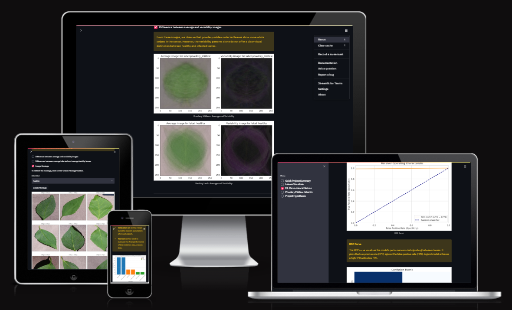
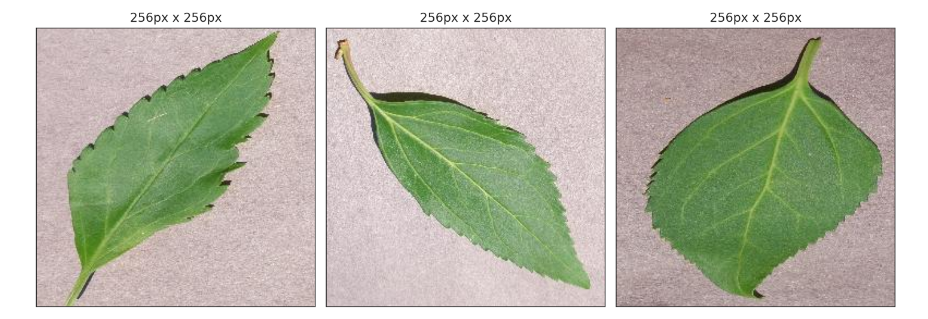
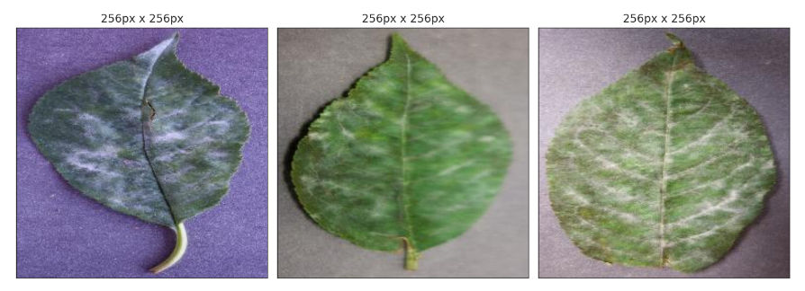
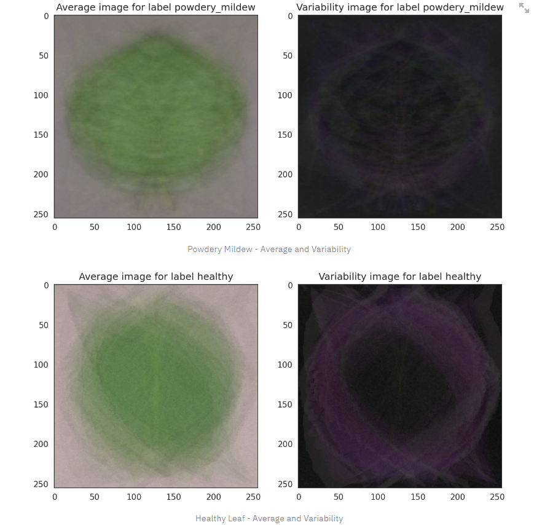
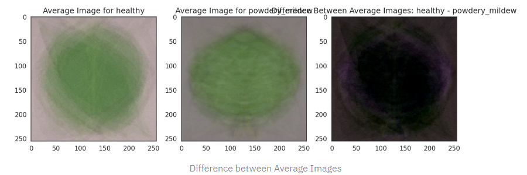
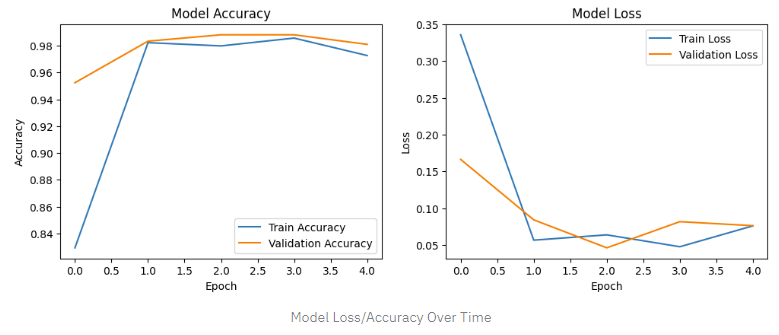

## Introduction

The Cherry Leaf Powdery Mildew Detector is an innovative machine learning solution project, the 5th and final Project of the Code Institute's Bootcamp in Full Stack Software Development with specialization in Predictive Analytics. The aim of the detector is to assist farmers and agricultural experts in the early detection of powdery mildew on cherry leaves. Powdery mildew is a fungal disease that can severely affect crop yield and quality, making timely intervention crucial for minimizing damage. This project utilizes Convolutional Neural Networks (CNNs) to analyze images of cherry leaves and accurately classify them as either healthy or infected.

With an emphasis on achieving high accuracy (targeting at least 97%), the model is integrated into a user-friendly dashboard that allows users to upload images and receive real-time predictions. The solution aims to make advanced image classification technology accessible to users in agriculture, ensuring proactive crop management and disease control. Furthermore, the project is designed with scalability in mind, allowing future adaptations for other plant diseases or crops.

*Figure: Cherry Leaf Powdery Mildew Detector – Responsive design preview.*

### Deployed version at [clmp-detector-fc49f90c032e.herokuapp.com/](https://clmp-detector-fc49f90c032e.herokuapp.com/)

## Table of Contents
1. [Dataset Content](#dataset-content)
2. [Business Requirements](#business-requirements)
3. [Hypothesis and validation](#hypothesis-and-validation)
4. [Rationale for the model](#the-rationale-for-the-model)
5. [Implementation of the Business Requirements](#the-rationale-to-map-the-business-requirements-to-the-data-visualizations-and-ml-tasks)
6. [ML Business case](#ml-business-case)
7. [Dashboard design](#dashboard-design-streamlit-app-user-interface)
8. [Unfixed Bugs](#unfixed-bugs)
9. [Deployment](#deployment)
10. [Technologies used](#technologies-used)
11. [Testing](#testing)
12. [Credits](#credits)

## Dataset Content
The dataset used for this project consists of 4208 featured images of cherry leaves sourced from [Kaggle](https://www.kaggle.com/datasets/codeinstitute/cherry-leaves). They are categorized into two classes: **healthy leaves** and **leaves infected by powdery mildew**. The data was collected to assist in training a machine learning model capable of detecting the presence of powdery mildew on cherry leaves by examining visual symptoms.

### Structure of the Dataset

- **Images:** The dataset contains high-quality images of cherry leaves in RGB format.
- **Classes:** There are two distinct classes:
    - __Healthy:__ Cherry leaves that show no signs of infection.
    - __Powdery mildew:__ Leaves displaying visual signs of white powdery growth and circular lesions.

### Data Distribution

The dataset is split into three subsets for model training and evaluation:
- **Training Set:** Comprising 70% of the data, this set is used for training the model, allowing it to learn the patterns associated with healthy and infected leaves.
- **Validation Set:** 10% of the dataset is used to fine-tune the model during training, helping prevent overfitting.
- **Test Set:** The remaining 20% is reserved for testing the final model, ensuring that it can generalize to new, unseen data.

### Preprocessing Steps

Before using the images for model training, the following preprocessing steps were applied:

- **Resizing:** All images were resized to ensure uniform input size for the neural network.
- **Normalization:** The pixel values were normalized to improve the model’s ability to learn patterns effectively.
- **Augmentation:** Various data augmentation techniques such as flipping, rotating, and zooming were used to increase the robustness of the model by simulating different image perspectives.

[Back to top ⇧](#table-of-contents)

## Business Requirements

On conducting an [interview with Marianne McGuineys](https://github.com/Edgarkimbugwe/CLMP-Detector/wiki/Business-understanding-interview) the head of IT and Innovation at Farmy & Foods, the primary business requirement for this project was to build a robust system for early detection of powdery mildew on cherry leaves. The system must accurately differentiate between healthy and infected leaves, enabling farmers and agriculturalists to take timely actions to protect crops. To ensure reliability in real-world applications, the model must achieve a target accuracy of at least 97%, which is critical for minimizing false positives and negatives.

Additionally, the system should be integrated into a user-friendly dashboard where users, with little to no technical background, can easily upload images and receive real-time predictions. The solution must be scalable to handle other crops or plant diseases in the future, and the platform must be web-based to allow access across various devices, including mobile and desktop platforms, with minimal maintenance or technical intervention required.

In otherwords the business requirements summarised are: 
- Accurate Detection of Powdery Mildew on Cherry Leaves
- High Model Performance
- User-Friendly Dashboard for Prediction

[Back to top ⇧](#table-of-contents)

## Hypothesis and validation

### 1. Infected cherry leaves exhibit distinctive visual symptoms that can be identified through image analysis.

Cherry leaves affected by powdery mildew typically develop light-green circular lesions as an early symptom, followed by a white, cotton-like growth on the infected area. These visible signs of infection are not only distinguishable by the human eye but can also be captured and analyzed using machine learning techniques. In this context, image analysis allows us to extract key features like the texture, color distribution, and lesion patterns, enabling the model to differentiate between healthy and infected leaves.

For machine learning to effectively leverage these features, it's crucial to prepare the images correctly before they are fed into the model. This involves normalizing the images, which ensures that the pixel values are standardized, allowing the model to achieve consistent results across various test scenarios. The normalization process, in turn, aids in optimal feature extraction during training, especially in transfer learning scenarios where pre-trained models may be utilized.

In practical terms, this hypothesis assumes that despite variations in lighting, angles, or leaf orientation, the unique visual characteristics of infected leaves remain identifiable. Thus, the model's ability to generalize these patterns is critical for accurate predictions. By training the model on well-prepared images, it learns to focus on the general patterns of powdery mildew infection, rather than memorizing specific details from the training dataset.

Incorporating visual aids like image montages, which highlight differences between healthy and infected leaves, can further help in validating this hypothesis. Average and variability images between healthy and infected leaf samples can visually illustrate the significant distinctions the model captures, reinforcing its predictive capacity.

Clear difference between healthy and unhealhy leaves as seen in an image montage

A visual representation of the average and variability images for both healthy and infected cherry leaves. The average images highlight the general patterns across all samples, while the variability images emphasize the differences and inconsistencies between individual leaves, helping to identify distinguishing features of powdery mildew infection 

The comparison between the average healthy and infected leaves below highlights the distinct visual differences caused by powdery mildew. These differences, such as texture and color variations, are key indicators the model uses to distinguish between healthy and infected leaves during prediction

The model's success lies in its ability to generalize these learned patterns to new, unseen leaves' images, enabling timely and accurate detection of powdery mildew in cherry leaves, thus supporting early intervention in real-world agricultural settings.

### 2. Utilizing image normalization techniques enhances model performance in distinguishing between classes.

Normalization is a critical step in preparing images for machine learning, particularly in distinguishing between classes like healthy and powdery mildew-infected leaves. It involves scaling pixel values of the images to ensure consistent ranges across the dataset, typically between 0 and 1. This consistency helps stabilize the training process, reduces variance, and allows the model to focus on essential features rather than noise. By normalizing the dataset, the model generalizes better to new unseen data, improving its ability to accurately differentiate between classes, such as healthy and infected leaves.

**Accuracy and Loss Over Epochs After Image Normalization**

The accuracy and loss plots provided visually demonstrate the impact of normalization techniques on model performance. As shown in the Model Accuracy graph (left), both training and validation accuracies increase sharply at the start and stabilize after the second epoch. The validation accuracy surpasses the training accuracy at multiple points, suggesting that the model generalizes well to unseen data. This indicates that the normalization process is likely contributing to this generalization by ensuring consistency in input data, thus enhancing the model's ability to distinguish between classes like healthy and powdery mildew-infected leaves.

In the Model Loss graph (right), training and validation losses decrease significantly during the first epoch, with the validation loss maintaining a consistently low value throughout training. This supports the hypothesis that normalization reduces noise and variance in the input data, allowing the model to focus on relevant features (such as the subtle visual differences between healthy and infected leaves) rather than being distracted by inconsistencies in pixel intensity or distribution.

The relatively low validation loss compared to training loss also suggests that the model is not overfitting, further confirming that normalization has improved the model’s ability to generalize and differentiate between healthy and infected leaves with a high degree of accuracy.

### 3. Incorporating augmented training data leads to improved model robustness.

Training models with augmented data helps to increase their robustness by exposing them to a wider variety of data points. Data augmentation techniques, such as rotation, flipping, zooming, and shifting, simulate different perspectives of cherry leaves, thus allowing the model to learn features that are invariant to these changes. This approach increases the model's ability to generalize, making it more resilient to different lighting conditions, angles, and noise that the model may encounter when presented with real-world images. Augmented data helps prevent overfitting, where the model becomes too specialized in the training dataset and fails to perform well on unseen data.

**NOTE: Refer to the image (Accuracy and Loss Over Epochs After Image Normalization) above.** 

On reviewing the model history file, it illustrates how augmented data improves model robustness. In the Model Accuracy graph, both training and validation accuracies show stability after the initial increase, indicating good generalization to unseen data. This is due to training on augmented data, which exposes the model to diverse real-world variations like different perspectives and lighting.

On the other hand, the Model Loss graph reveals low and stable validation loss, suggesting the model is not overfitting, further supporting the effectiveness of data augmentation. This approach allows the model to adapt better to variations in test data, enhancing its resilience to changes in orientation, scale, or noise. Overall, the steady performance depicted in the graphs demonstrates that incorporating augmented data significantly strengthens the model's ability to handle real-world scenarios.

[Back to top ⇧](#table-of-contents)

## The rationale for the model

The rationale for developing the model centers on the pressing need for accurate detection of powdery mildew in cherry leaves, a common agricultural challenge that can significantly impact crop yields. The model employs advanced image analysis techniques to identify subtle visual symptoms indicative of infection, allowing for early intervention and management. By leveraging deep learning and convolutional neural networks (CNNs), the model is designed to learn from a diverse dataset of leaf images, enabling it to generalize effectively across different conditions and variations. The ultimate goal is to provide the client a reliable tool that enhances the ability to monitor healthy and unhealthy leaves. 

## The rationale to map the business requirements to the Data Visualizations and ML tasks

### Business Requirement 1: Data Visualization
- As a client, I want to navigate easily through an interactive dashboard so that I can access various data visualizations and understand the data.
- As a client, I want to view side-by-side visual graphs of average images, differences, and variabilities between healthy and infected leaves, so that I can easily identify distinguishing features.
- As a client, I want to explore an image montage of healthy and infected leaves, so that I can visually differentiate between the two classes.
- I want the dashboard to display a confusion matrix, so I can easily see how well the model is performing in distinguishing between healthy and infected leaves.

### Business Requirement 2: Classification
- As a client, I want to track the model's accuracy and loss over epochs through dynamic plots, so I can monitor its training progress and ensure it meets the target accuracy of 97% or higher.
- As a client, I want to visualize the impact of image normalization and data augmentation techniques on the model's performance, allowing me to understand the effectiveness of these approaches.
- As a client, I want to review performance metrics on a validation dataset to confirm the model's ability to generalize well to unseen data.

### Business Requirement 3: Report
- As a client, I want a user-friendly interface that allows me to upload images of cherry leaves and receive immediate feedback on their health status, enhancing my decision-making process.
- As a client, I want visualizations of the dataset's distribution, including the proportions of healthy versus infected leaves, to better understand the data used for training the model.
- As a client, I want clear instructions and contextual information alongside the visualizations, ensuring I can navigate the dashboard easily and interpret the results effectively.

[Back to top ⇧](#table-of-contents)

## ML Business Case

1. **Objective:** The goal of this project is to build an ML model that predicts whether a cherry leaf is infected with powdery mildew, based on the provided image dataset. This is framed as a supervised learning problem, specifically a binary classification task where the model must determine if a leaf is "healthy" or "infected."

2. **Desired Outcome:** The model aims to provide the client with a quicker and more reliable method to detect powdery mildew early through early detection and allow timely intervention.

3. **Success Metrics:**

    - **Accuracy:** The model must achieve a minimum accuracy of 97% on the test set.
    _ **User Experience:** The detection results should be presented in real-time after a user uploads an image, without requiring batch processing.

4. **Model Output:** The output of the model will be a binary flag indicating whether the cherry leaf is healthy or infected, along with the probability score for each prediction. This output will be easily accessible through a user-friendly dashboard, allowing users to upload leaf images and instantly receive diagnostic results.

5. **Current Detection Heuristics:** Traditionally, farmers visually inspect cherry trees to detect signs of powdery mildew. This process can take up to 30 minutes per tree, and human error can lead to inaccurate diagnoses. By using image-based detection, the proposed solution improves speed, consistency, and accuracy over manual inspection.

6. **Training Data:** The training data comes from a dataset of cherry leaf images uploaded to Kaggle, which includes 4,208 labeled images (healthy or infected). The dataset is crucial for training and validating the model.

7. **Business Benefits:**

    - **Efficiency:** The model will save farmers significant time compared to manual inspection processes.
    - **Reliability:** The model reduces human error in detecting powdery mildew, leading to more consistent outcomes and better decision-making.
    - **Scalability:** The solution can be scaled to analyze larger datasets, potentially expanding to other crops affected by powdery mildew or similar diseases.

**To understand more about the ML Business Case, visit the [Detector's Wiki](https://github.com/Edgarkimbugwe/CLMP-Detector/wiki)**

[Back to top ⇧](#table-of-contents)

## Dashboard Design (Streamlit App User Interface)

You're right! Let's update the write-up to clearly map each part of the dashboard to the specific business requirements.

---

### Dashboard Overview

The **Cherry Leaf Powdery Mildew Detection Dashboard** provides users with an intuitive interface to predict powdery mildew infections on cherry leaves using machine learning. The dashboard integrates several key features to address the business requirements, ensuring accurate detection, high model performance, and a user-friendly experience.

#### Dashboard Menu:

1. **Quick Project Summary**  
   This section gives an overview of the powdery mildew disease and explains the business objectives of the project. The summary outlines the need for accurate detection and provides background on how powdery mildew affects cherry leaves, compromising yield if left untreated.  
   **Addresses Business Requirement:**  
   - *Accurate Detection of Powdery Mildew on Cherry Leaves*

2. **Leaves Visualizer**  
   Users can explore visual differentiations between healthy and infected leaves through various visual aids like average images, variability images, and montages. These visualizations help in understanding the distinctive symptoms of powdery mildew, such as white cotton-like growth on the leaves, making it easier to identify infected leaves.  
   **Addresses Business Requirement:**  
   - *Accurate Detection of Powdery Mildew on Cherry Leaves*  
   - *High Model Performance* (by demonstrating the visual patterns that the model learns from)

3. **ML Performance Metrics**  
   This section provides a detailed analysis of the model’s performance across the dataset, showing accuracy and loss over epochs. This supports the need for high-performance models, ensuring that the system is reliable enough for real-world application.  
   **Addresses Business Requirement:**  
   - *High Model Performance* (Target: 97% accuracy)

4. **Powdery Mildew Detector**  
   This is the key functionality where users can upload images of cherry leaves and receive real-time predictions about whether the leaves are infected or healthy. Multiple images can be uploaded at once, and a report with the results can be downloaded, making it easy for client to monitor the health of their plants quickly and efficiently.  
   **Addresses Business Requirement:**  
   - *User-Friendly Dashboard for Prediction*  
   - *Accurate Detection of Powdery Mildew on Cherry Leaves*

5. **Project Hypothesis**  
   This section explains the project's three hypotheses, focusing on how visual symptoms, image normalization, and augmented training data improve the model’s robustness and accuracy. Each hypothesis is backed by data and visual outputs, tying into the goals of accurate detection and reliable model performance.  
   **Addresses Business Requirement:**  
   - *High Model Performance*  
   - *Accurate Detection of Powdery Mildew on Cherry Leaves*

[Back to top ⇧](#table-of-contents)

## Unfixed Bugs
* There are no unfixed bugs.

## Deployment

The project is coded and hosted on GitHub and deployed with [Heroku](https://www.heroku.com/).

### Creating the Heroku app 
The steps needed to deploy this projects are as follows:

1. Create a `requirement.txt` file in GitHub, for Heroku to read, listing the dependencies the program needs in order to run.
2. Set the `runtime.txt` Python version to a Heroku-20 stack currently supported version.
3. `push` the recent changes to GitHub and go to your [Heroku account page](https://id.heroku.com/login) to create and deploy the app running the project. 
3. Chose "CREATE NEW APP", give it a unique name, and select a geographical region. 
4. Add  `heroku/python` buildpack from the _Settings_ tab.
5. From the _Deploy_ tab, chose GitHub as deployment method, connect to GitHub and select the project's repository. 
6. Select the branch you want to deploy, then click Deploy Branch.
7. Click to "Enable Automatic Deploys " or chose to "Deploy Branch" from the _Manual Deploy_ section. 
8. Wait for the logs to run while the dependencies are installed and the app is being built.
9. The mock terminal is then ready and accessible from a link similar to `https://your-projects-name.herokuapp.com/`
10. If the slug size is too large then add large files not required for the app to the `.slugignore` file.
   
### Forking the Repository

- Below are the steps to fork the repository:
    - Locate the [GitHub Repository](https://github.com/Edgarkimbugwe/CLMP-Detector) of this project and log into your GitHub account. 
    - Click on the "Fork" button, on the top right of the page, just above the "Settings". 
    - Then locate 'Create Fork' below the page and click on it. 
    - You now have a copy of the original repository in your GitHub account.

### Making a local clone

- Below are the steps to clone a repository:
    - On the page for the [repository](https://github.com/Edgarkimbugwe/CLMP-Detector), click the 'Code' button
    - To clone the repository using HTTPS, copy the HTTPS URL provided there
    - Open your CLI application of choice and change the current working directory to the location where you want the cloned directory to be made.
    - Type git clone, and then paste the previously copied URL to create the clone

[Back to top ⇧](#table-of-contents)

## Technologies used

### Main Data Analysis and Machine Learning Libraries
- [NumPy](https://numpy.org/): Essential for numerical computing and image processing; converts images into arrays for manipulation.
- [Pandas](https://pandas.pydata.org/): Facilitates data manipulation with DataFrames, making it easier to handle and analyze structured data.
- [Matplotlib](https://matplotlib.org/): Enables plotting and visualization of image and tabular data, helping to analyze model performance.
- [Seaborn](https://seaborn.pydata.org/): Enhances data visualization with attractive statistical graphics, used for confusion matrix heatmaps and scatter plots.
- [Plotly](https://plotly.com/python/): Allows for interactive data visualization; used in the dashboard for dynamic charts.
- [TensorFlow](https://www.tensorflow.org/versions/r2.6/api_docs/python/tf): A powerful machine learning library for building and training the model.
- [Keras Tuner](https://keras.io/keras_tuner/): Assists in hyperparameter tuning to optimize model performance.
- [Scikit-learn](https://scikit-learn.org/): Provides tools for calculating class weights and generating classification reports to assess model performance.
- [PIL Image](https://pillow.readthedocs.io/en/stable/reference/Image.html): Used for various image manipulation tasks.
- [Streamlit](https://streamlit.io/): Creation of the dashboard

### Platforms
- [Heroku](https://en.wikipedia.org/wiki/Heroku): A cloud platform that enables easy deployment and scaling of web applications, including the project dashboard.
- [Jupiter Notebook](https://jupyter.org/): An interactive coding environment that allows for the creation of documents containing live code, equations, visualizations, and narrative text, often used for data analysis
- [Kaggle](https://www.kaggle.com/): A platform for data science and machine learning where datasets can be found, shared, and analyzed; it also provides a collaborative environment for model development.
- [GitHub](https://github.com/): A version control repository that hosts source code, facilitates collaboration, and tracks changes, ensuring code management and backup.
- [Gitpod](https://www.gitpod.io/): An online IDE that provides a pre-configured development environment in the cloud, enabling seamless coding directly from a browser.

### Languages
- [Python](https://www.python.org/)
- [Markdown](https://en.wikipedia.org/wiki/Markdown)

[Back to top ⇧](#table-of-contents)

## TESTING
### Manual Testing

#### User Story Testing
*Business Requirement 1: Data Visualization**

| User Story | Feature | Action | Expected Result | Actual Result | 
| --- | --- | --- | --- | --- |
| User Story 1 | Navigation bar | Selecting buttons from the side menu | Selected page displayed with correct information | Functions as expected |
| --- | --- | --- | --- | --- |
| User Story 2 | Visual graphs of image data | Viewing average images, differences, and variabilities between healthy and infected leaves | Graphs clearly show differences between healthy and infected leaves | Functions as expected |
| --- | --- | --- | --- | --- |
| User Story 3 | Image montage display | Viewing image montage of healthy and infected leaves | Montage accurately displays both healthy and infected leaf images for visual differentiation | Functions as expected |
| User Story 4 | Confusion matrix display | Model permance to distinguish between healthy and infected leaves | Display of TP, TN and FN, FP | Functions as expected |

*Business Requirement 2: Classification*

| User Story | Feature | Action | Expected Result | Actual Result | 
| --- | --- | --- | --- | --- |
| User Story 1 | Training progress plots | Viewing accuracy and loss over epochs on ML Performance Metrics page | Dynamic plots showing model's accuracy and loss over time | Functions as expected |
| User Story 2 | Image normalization and augmentation impact visualization | Viewing visualizations of model performance changes on ML Performance Metrics page | Performance impact of normalization and augmentation shown clearly | Functions as expected |
| User Story 3 | Validation performance metrics | Reviewing precision, recall, and F1 scores on validation dataset in ML Performance Metrics | Metrics displayed for assessing model generalization to unseen data | Functions as expected |

*Business Requirement 3: Report*

| User Story | Feature | Action | Expected Result | Actual Result | 
| --- | --- | --- | --- | --- |
| User Story 1 | Image Upload & Feedback | Uploading cherry leaf images in Powdery Mildew Detector | Immediate prediction of leaf health status displayed | Functions as expected |
| User Story 2 | Dataset Distribution Visualization | Viewing dataset distribution in Quick Project Summary | Proportions of healthy vs. infected leaves displayed clearly | Functions as expected |
| User Story 3 | Contextual Information & Instructions | Reading provided instructions and context across dashboard pages | Clear instructions aiding in dashboard navigation and result interpretation | Functions as expected |

[Back to top ⇧](#table-of-contents)

## Credits

- The template used for this project belongs to CodeInstitute - [GitHub](https://github.com/Code-Institute-Submissions)
- CI's Malaria Detection walkthrough
- Edureka - [Cancer Detection Using Deep Learning](https://www.youtube.com/watch?v=7MceDfpnP8k&list=PL9ooVrP1hQOFx3U6DNqm-IwbWARdw2iEB&ab_channel=edureka%21)
- Scikit-learn - [Understanding Learning Curves](https://scikit-learn.org/stable/auto_examples/model_selection/plot_learning_curve.html) 

### Content
- The leaves dataset was linked from [Kaggle](https://www.kaggle.com/datasets/codeinstitute/cherry-leaves) and created by [Code Institute](https://www.kaggle.com/codeinstitute)
- The following sources were used to understand powdery mildew, [Powdery Mildews – 2.902, by by S. Newman and L.P. Pottorff](https://extension.colostate.edu/topic-areas/yard-garden/powdery-mildews-2-902/#:~:text=Powdery%20mildew%20is%20one%20of,or%20tolerant%20to%20powdery%20mildew.) and [garden design](https://www.gardendesign.com/how-to/powdery-mildew.html)

### Media
- The banner was developed using Ms Word tools

### Acknowledgements

- Special thanks to my mentor Mo Shami, for his guidance and insightful suggestions. His expertise and guidance was key to the success of this project. 

- To the members of Community-Sweden on Slack, thank you for your constant support, guidance, and advice. Your encouragement and collaboration have truly made a difference, providing the push and belief needed to keep going.

[Back to top ⇧](#table-of-contents)
